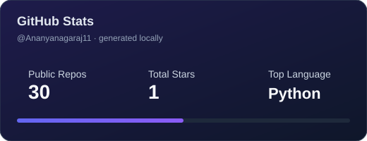
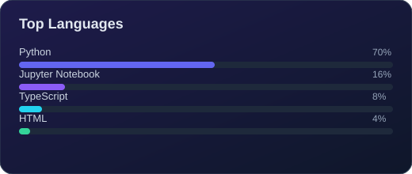

<div align="center">

# Ananya Naga Raj

**Software Engineer · AI Engineer · Backend Engineer · ML Engineer**

MS Computer Science @ Syracuse University · May 2026


<br/>

<a href="mailto:ananya.nagaraj11@gmail.com"></a>
<a href="https://www.linkedin.com/in/ananyanagaraj/"></a>
<a href="https://github.com/Ananyanagaraj11"></a>
<a href="https://ananyanagaraj.lovable.app/"></a>
<a href="https://orcid.org/0009-0000-6576-6232"></a>

</div>

---

## Introduction

**Software Engineer · AI Engineer · Backend Engineer · ML Engineer · LLM Engineer**

MS **Computer Science** @ **Syracuse University** (May 2026). I build **production backend systems**, **LLM/RAG platforms**, **computer vision pipelines**, and **cloud-native services** — from Java/Kafka microservices to FastAPI inference APIs and PyTorch ML dashboards.

---

## About Me

```yaml
name: Ananya Naga Raj
location: Texas, USA (open to relocation)
education: MS Computer Science, Syracuse University
roles:
  - AI Engineer
  - Backend Engineer
  - Machine Learning Engineer
  - Python Engineer
  - Distributed Systems Engineer
  - LLM Engineer
  - Data Engineer
focus:
  - FastAPI / Spring Boot microservices
  - Agentic AI, RAG, LangChain, LangGraph
  - PyTorch ML pipelines & OpenCV research systems
  - Docker, Kubernetes, AWS, CI/CD
open_to: Software Engineer & AI Engineer roles · May 2026
```

---

## Professional Timeline

| Period | Role | Organization | Engineering Impact |
|:--|:--|:--|:--|
| **Aug 2025 – Present** | AI Software Engineer | **Honeywell** | RAG + agentic AI platform · **2 vector DBs** · **2 LLM platforms** (Bedrock, OpenAI) · K8s microservices |
| **Jun 2021 – Jul 2024** | Software Engineer | **MetaSystems** | Spring Boot backend · **80+ feeds/day** · Kafka/RabbitMQ · **20% SQL optimization** · **85% test coverage** |
| **Jan – May 2026** | Research Assistant | **Syracuse University** | CV plot digitizer · **18 API routes** · **29 reference datasets** · **907 LOC** extraction library |

> Honeywell & MetaSystems are **professional experience** (proprietary — not open-source repos).  
> Summaries: [Honeywell](./docs/HONEYWELL-README.md) · [MetaSystems](./docs/METASYSTEMS-README.md)

---

## Tech Stack

### Languages


### Backend


### AI / ML / LLM


### Cloud · DevOps · MLOps


### Databases


---

## AI Expertise

| Domain | Engineering Focus |
|:--|:--|
| **Agentic AI** | Multi-agent workflows, tool calling, HITL validation (Honeywell) |
| **RAG** | Hybrid search, reranking, Pinecone + ChromaDB vector retrieval |
| **LLMs** | AWS Bedrock, OpenAI, prompt engineering, eval pipelines |
| **ML Pipelines** | PyTorch training/inference, scikit-learn preprocessing, artifact deployment |
| **Computer Vision** | OpenCV plot digitization, validation metrics (RMSE, Pearson) |

## Backend Expertise

| Domain | Engineering Focus |
|:--|:--|
| **Microservices** | Java Spring Boot, ASP.NET Core / C#, FastAPI, gRPC, REST APIs |
| **Event-Driven Systems** | Kafka, RabbitMQ, Redis async pipelines |
| **Data Engineering** | Spark / PySpark ingest, ETL, PostgreSQL, batch processing |
| **Distributed Systems** | Container orchestration, CI/CD, cloud-native deployment |

---

## Featured Projects

<table>
<tr>
<td width="50%" valign="top">

### Honeywell — Enterprise AI Platform
*Professional experience · proprietary*

| | |
|:--|:--|
| **Impact** | RAG + agentic workflows for enterprise knowledge retrieval |
| **Scale** | 2 vector DBs · 2 LLM platforms · K8s microservices |
| **Stack** | FastAPI · LangChain · LangGraph · Pinecone · ChromaDB · AWS |

[Architecture doc](./docs/HONEYWELL-README.md)

</td>
<td width="50%" valign="top">

### MetaSystems — Enterprise Backend
*Professional experience · proprietary*

| | |
|:--|:--|
| **Impact** | **80+ financial/regulatory feeds/day** via Spring Boot |
| **Performance** | **20% SQL improvement** · **85% code coverage** |
| **Stack** | Java · Kafka · RabbitMQ · PostgreSQL · Jenkins · K8s |

[Architecture doc](./docs/METASYSTEMS-README.md)

</td>
</tr>
<tr>
<td width="50%" valign="top">

### Enterprise Decision Intelligence
[](https://github.com/Ananyanagaraj11/enterprise-decision-intelligence.)
[](https://enterprise-decision-intelligence.onrender.com/)

- **5 agents** + controller · **10 FastAPI endpoints**
- **12 corrective actions** · eval **407.4 ms** (92-row dataset)
- **11 pytest** tests · Django + Streamlit dashboards

`Python` `FastAPI` `Django` `Docker`

</td>
<td width="50%" valign="top">

### SOC Lite AI IDS
[](https://github.com/Ananyanagaraj11/soc-lite-ai-ids)
[](https://ai-cyber-threat-dashboard-1.onrender.com/dashboard/index.html)

- **13,538** params · **20** features · **5** REST endpoints
- Batch inference up to **1,000** records
- PyTorch + FastAPI SOC dashboard

`PyTorch` `FastAPI` `Docker`

</td>
</tr>
<tr>
<td width="50%" valign="top">

### Enterprise Integration Hub
[](https://github.com/Ananyanagaraj11/enterprise-integration-hub)

- API-led System / Process / Experience APIs, JWT gateway, sagas, DLQ
- 800-feed Spark canonicalizer + quality gates + JS ops console
- Docker, Kubernetes, Terraform notes, pytest, GitHub Actions CI

`C#` `.NET` `Python` `FastAPI` `JavaScript` `PySpark` `Kafka-patterns`

</td>
<td width="50%" valign="top">

Interview-scale integration platform: API gateway, events, Spark, .NET, and a JavaScript console. Not proprietary work code.

</td>
</tr>
<tr>
<td width="50%" valign="top">

### Rheology Plot Digitizer (Research)
[](https://github.com/Ananyanagaraj11/automated-scatter-plot-data-extraction)
[](https://colab.research.google.com/github/Ananyanagaraj11/automated-scatter-plot-data-extraction/blob/main/Rheology_Dashboard.ipynb)

- **29** reference datasets · **18** API routes · **5** UI pages
- **907 LOC** · **26** functions · **10-stage** pipeline

`OpenCV` `Django` `SciPy`

</td>
<td width="50%" valign="top">

### SafeVoice AI
[](https://github.com/Ananyanagaraj11/safevoice-ai)
[](http://safevoiceai.netlify.app/)

- Whisper `base` + **2** Hugging Face NLP models
- Flask API + React dashboard + PDF reports

`Flask` `React` `Transformers`

</td>
</tr>
<tr>
<td width="50%" valign="top">

### Medical NER (BioBERT)
[](https://github.com/Ananyanagaraj11/medical-ner-biobert)
[](https://medical-ner-dashboard.vercel.app/)

- Interactive biomedical entity extraction dashboard
- Live prediction UI with entity highlighting

`React` `BioBERT` `Transformers`

</td>
<td width="50%" valign="top">

### BizPulse Analytics
[](https://github.com/Ananyanagaraj11/BizPulse-Analytics-Dashboard)
[](https://bizpulse-analytics-dashboard-5c8cvwu7drn9yymrjydmd4.streamlit.app/)

- Business analytics KPI dashboard
- Streamlit interactive charts and filters

`Python` `Streamlit` `Pandas`

</td>
</tr>
<tr>
<td width="50%" valign="top">

### Agentic Research Intelligence
[](https://github.com/Ananyanagaraj11/agentic-research-intelligence-dashboard)
[](https://frontend-two-gilt-97.vercel.app)

- Agent-driven research workflow dashboard
- Full-stack React frontend + API backend

`React` `FastAPI` `LLMs`

</td>
<td width="50%" valign="top">

### IoT Attack Detection
[](https://github.com/Ananyanagaraj11/iot-attack-detection-dashboard)
[](https://ananyanagaraj11.github.io/iot-attack-detection-dashboard/)

- Network attack visualization dashboard
- Interactive threat monitoring UI

`JavaScript` `D3.js` `IoT`

</td>
</tr>
</table>

---

## Engineering Achievements

| Achievement | Source |
|:--|:--|
| **18 REST API routes** on research digitization platform | GitHub / notebooks |
| **80+ data feeds/day** enterprise backend throughput | MetaSystems experience |
| **7+ live demos** (EDI, SOC Lite, SafeVoice, Medical NER, BizPulse, Agentic Research, IoT) | Render · Vercel · Netlify · Streamlit · GitHub Pages |
| **5-agent decision pipeline** with evaluation harness | EDI repository |

---

## Education

| Degree | Institution | Period |
|:--|:--|:--|
| **MS Computer Science** | Syracuse University, NY | Aug 2024 – May 2026 |

> Degree certificate PDFs are **not** uploaded here (they often contain personal IDs). List education in text; share transcripts only when employers request them.

---

## Certifications

Public professional credentials only — verification links preferred over PDF uploads.

| Certification | Issuer |
|:--|:--|
| Foundations of AI and Machine Learning | **Microsoft** |
| Google Large Language Model | **Google** |

[](https://learn.microsoft.com/en-us/credentials/)
[](https://www.cloudskillsboost.google/)

_Add Credly or Google Skills Boost profile URLs here when you have them — safer than posting certificate PDFs._

---

## Research

**Syracuse University — Biomedical & Chemical Engineering (Rheology Lab)**

- Automated extraction of G′/G″ curves from published rheology plots
- Validation against **29** human-reference CSVs across **7** literature sources
- Django research dashboard with batch processing and experiment history

---

## GitHub Analytics

<div align="center">

<!-- Local SVGs (reliable — commit & push the assets/ folder) -->



<br/><br/>


<br/><br/>

<!-- Auto-generated by .github/workflows/snake.yml into assets/ -->
<picture>
  <source media="(prefers-color-scheme: dark)" srcset="./assets/github-snake-dark.svg"/>
  <source media="(prefers-color-scheme: light)" srcset="./assets/github-snake.svg"/>
  
</picture>

</div>

---

## Connect With Me

<div align="center">

[](mailto:ananya.nagaraj11@gmail.com)
[](https://www.linkedin.com/in/ananyanagaraj/)
[](https://ananyanagaraj.lovable.app/)
[](https://github.com/Ananyanagaraj11)

<br/>


</div>

---

<div align="center">


<br/>

**Building backend systems and AI platforms with measurable engineering impact.**

⭐ Star my pinned repositories if you find them useful.

</div>
