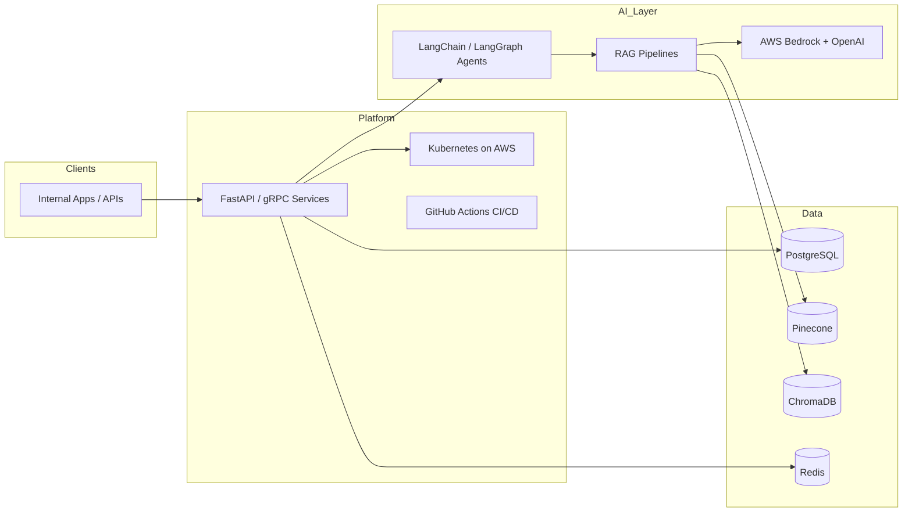

# Honeywell — Experience Analysis (No Public Repository)

> **Status:** No `Honeywell` repository exists on GitHub (public or private) as of audit date.  
> Analysis below is from **resume-stated professional experience** only — not from codebase inspection.

## Role

| Field | Value |
|---|---|
| Company | Honeywell |
| Title | AI Software Engineer |
| Period | Aug 2025 – Present |
| Location | USA (Remote) |

## Architecture (Inferred from Stated Work)

## Tech Stack (Resume-Verified)

| Layer | Technologies |
|---|---|
| Languages | Python |
| Backend | FastAPI, Django, gRPC |
| AI / LLM | LangChain, LangGraph, RAG, GPT-4o, AWS Bedrock, OpenAI |
| Vector Search | Pinecone, ChromaDB, hybrid search, embeddings |
| Data | PostgreSQL, Redis |
| Platform | Docker, Kubernetes, AWS, GitHub Actions |
| Practices | HITL validation, prompt engineering, reranking, observability |

## Engineering Contributions (Resume-Stated)

| Feature | Description | Stated Metrics |
|---|---|---|
| Enterprise AI Assistant | RAG apps for semantic search & Q&A | Enterprise knowledge repositories |
| Agentic AI Workflows | Multi-agent + tool calling + HITL | Cross-functional Agile delivery |
| Enterprise RAG Platform | Retrieval pipelines | **2 vector DBs** (Pinecone, ChromaDB) |
| AI Platform Services | Inference, document processing, orchestration | Cloud-native microservices |
| LLM Performance Optimization | Prompting, retrieval, reranking, hallucination mitigation | Response consistency workflows |
| AI Model Operations | Bedrock + OpenAI integration | **2 production LLM platforms**; testing/monitoring pipelines |

## What NOT to Claim on GitHub

- Do not create a public repo with proprietary Honeywell code or data
- Do not invent latency, accuracy, or user-count metrics without measurement
- Do not link to non-existent Honeywell repos from profile README

## Recommendation

Keep Honeywell in **Professional Experience** on profile README only. If you need a repo card, create a **private** sanitized architecture demo or use this analysis doc internally.
