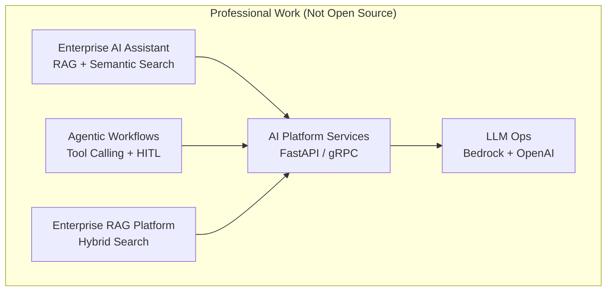

# Honeywell — Enterprise AI Platform (Portfolio Summary)

> **Note:** This documents professional work at Honeywell. Source code is proprietary and not published.  
> This README is a **sanitized engineering summary** for portfolio / interview discussion.

[](https://www.python.org/)
[](https://fastapi.tiangolo.com/)
[](https://www.langchain.com/)
[](https://aws.amazon.com/)
[](https://www.docker.com/)
[](https://kubernetes.io/)

## Overview

Built enterprise AI services combining **RAG**, **agentic workflows**, and **cloud-native deployment** for internal knowledge retrieval, document Q&A, and workflow automation.

| | |
|---|---|
| **Role** | AI Software Engineer |
| **Period** | Aug 2025 – Present |
| **Stack** | Python, FastAPI, LangChain, LangGraph, PostgreSQL, Pinecone, ChromaDB, Redis, AWS, Docker, Kubernetes |

## Architecture



## Key Features

| Feature | Engineering Focus |
|---|---|
| **Enterprise AI Assistant** | RAG applications with FastAPI, LangChain, and GPT-4o for semantic search and contextual Q&A |
| **Agentic AI Workflows** | Multi-agent orchestration with tool calling and Human-in-the-Loop validation |
| **Enterprise RAG Platform** | Production retrieval pipelines with **2 vector databases** (Pinecone, ChromaDB), embeddings, and hybrid search |
| **AI Platform Services** | Microservices for inference serving, document processing, and workflow orchestration |
| **LLM Performance Optimization** | Prompt engineering, contextual retrieval, reranking, hallucination mitigation |
| **AI Model Operations** | **2 production LLM platforms** (AWS Bedrock, OpenAI); automated testing, monitoring, observability |

## Tech Stack

| Category | Technologies |
|---|---|
| Backend | Python, FastAPI, Django, gRPC |
| AI / LLM | LangChain, LangGraph, RAG, GPT-4o, AWS Bedrock, OpenAI |
| Vector Search | Pinecone, ChromaDB, hybrid search, embedding models |
| Data | PostgreSQL, Redis |
| DevOps | Docker, Kubernetes, AWS, GitHub Actions |

## API Surface (Conceptual)

| Service Area | Capabilities |
|---|---|
| Inference APIs | FastAPI / gRPC AI inference endpoints |
| RAG APIs | Document retrieval, semantic search, Q&A |
| Agent APIs | Multi-agent workflow orchestration with HITL gates |

> Detailed API specs are proprietary. Discuss architecture patterns in interviews.

## Setup

```text
Not publicly available — proprietary employer codebase.
```

For technical discussion, see architecture diagram and feature table above.

## Screenshots

| Component | Preview |
|---|---|
| RAG Dashboard | _Placeholder — add sanitized internal screenshot if approved_ |
| Agent Workflow UI | _Placeholder_ |
| Monitoring / Eval | _Placeholder_ |

## Engineering Decisions

- **Dual vector stores (Pinecone + ChromaDB)** for flexible retrieval experiments and hybrid search
- **HITL gates** on agent workflows for controlled automation in enterprise settings
- **FastAPI + gRPC** split for external REST consumers and internal high-throughput services
- **Kubernetes on AWS** for scalable, repeatable AI service deployment

## Future Improvements

- [ ] Unified LLM evaluation dashboard across Bedrock and OpenAI routes
- [ ] Automated regression suite for RAG retrieval quality
- [ ] Cost/latency observability per agent workflow
- [ ] Expanded hybrid search reranking benchmarks

## Contact

Questions about architecture approach (not proprietary code): [LinkedIn](https://www.linkedin.com/in/ananyanagaraj/)
