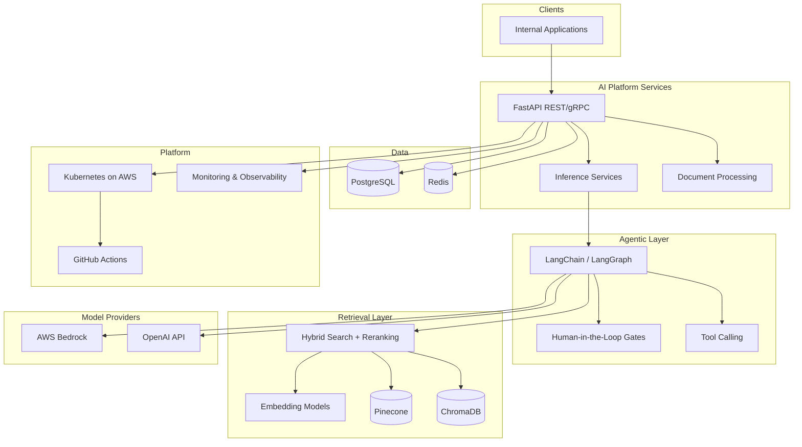

# Honeywell — Enterprise AI Platform (Portfolio Summary)

> **Repository status:** No public Honeywell GitHub repository exists. This document summarizes **professional engineering work** (proprietary).  
> **Do not publish employer source code.**

[](https://www.python.org/)
[](https://fastapi.tiangolo.com/)
[](https://www.langchain.com/)
[](https://langchain-ai.github.io/langgraph/)
[](https://aws.amazon.com/)
[](https://kubernetes.io/)

## Overview

| | |
|---|---|
| **Role** | AI Software Engineer |
| **Period** | Aug 2025 – Present |
| **Location** | USA (Remote) |
| **Focus** | Enterprise RAG, agentic AI, cloud-native AI microservices |

Built production-oriented AI services combining **retrieval-augmented generation**, **multi-agent orchestration**, and **Kubernetes deployment** for internal knowledge workflows.

## Architecture



## Features

| System | Engineering Impact |
|---|---|
| **Enterprise AI Assistant** | RAG-powered semantic search and contextual Q&A across enterprise knowledge repositories |
| **Agentic AI Workflows** | Multi-agent orchestration with tool calling and HITL validation; cross-functional Agile delivery |
| **Enterprise RAG Platform** | Production retrieval pipelines with **2 vector databases**, embeddings, hybrid search |
| **AI Platform Services** | Microservices for inference serving, document processing, workflow orchestration |
| **LLM Performance Optimization** | Prompt engineering, contextual retrieval, reranking, hallucination mitigation |
| **AI Model Operations** | **2 production LLM platforms** (Bedrock + OpenAI); automated testing & observability |

## Measurable Outcomes (Resume-Stated)

| Metric | Value |
|---|---|
| Vector databases integrated | **2** (Pinecone, ChromaDB) |
| Production LLM API platforms | **2** (AWS Bedrock, OpenAI) |
| Collaboration | Product managers, data scientists, platform engineers |

## Tech Stack

| Layer | Technologies |
|---|---|
| Backend | Python, FastAPI, Django, gRPC |
| AI / LLM | LangChain, LangGraph, RAG, GPT-4o, embeddings |
| Vector Search | Pinecone, ChromaDB, hybrid search, reranking |
| Data | PostgreSQL, Redis |
| DevOps | Docker, Kubernetes, AWS, GitHub Actions |

## API Surface (Conceptual)

| Area | Description |
|---|---|
| **Inference APIs** | FastAPI/gRPC endpoints for model serving |
| **RAG APIs** | Document retrieval, semantic search, Q&A |
| **Agent APIs** | Workflow orchestration with HITL approval gates |

> OpenAPI specifications are proprietary.

## Folder Structure (Typical Pattern)

```text
honeywell-ai-platform/          # conceptual — not published
├── services/
│   ├── inference-api/          # FastAPI / gRPC
│   ├── rag-pipeline/
│   └── agent-orchestrator/
├── agents/                     # LangChain / LangGraph workflows
├── retrieval/                  # Pinecone, ChromaDB clients
├── eval/                       # LLM evaluation & regression
├── infra/                      # K8s manifests, Docker, CI/CD
└── docs/
```

## Development Workflow

1. Feature design with product + platform teams  
2. Implement agent/RAG workflow in Python  
3. Integrate vector retrieval + LLM provider routes  
4. Add automated tests + observability hooks  
5. Deploy via CI/CD to Kubernetes on AWS  

## Deployment

| Component | Platform |
|---|---|
| AI microservices | Kubernetes (AWS) |
| Containers | Docker |
| CI/CD | GitHub Actions |
| Caching | Redis |
| Metadata | PostgreSQL |

## Screenshots

| View | Placeholder |
|---|---|
| RAG Q&A interface | _Add sanitized screenshot if approved by employer_ |
| Agent workflow monitor | _Placeholder_ |
| Observability dashboard | _Placeholder_ |

## Testing

- Automated LLM evaluation pipelines  
- Integration tests for FastAPI/gRPC services  
- Monitoring and observability for production AI deployments  

## Roadmap

- [ ] Unified eval dashboard across Bedrock and OpenAI routes  
- [ ] Automated RAG retrieval regression benchmarks  
- [ ] Cost/latency observability per agent workflow  
- [ ] Expanded hybrid search reranking experiments  

## Future Improvements

- Centralized prompt/version registry  
- Feature flags for agent workflow rollout  
- Expanded HITL audit trails for compliance  

---

**Contact:** [LinkedIn](https://www.linkedin.com/in/ananyanagaraj/) · Discuss architecture patterns only (no proprietary code)
