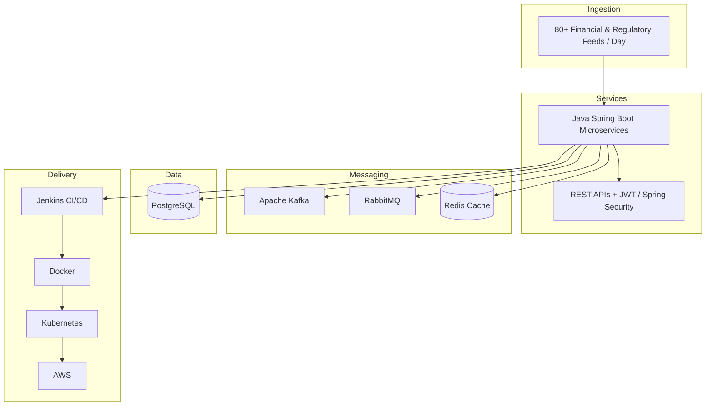

# MetaSystems — Experience Analysis (No Public Repository)

> **Status:** No `MetaSystems` / `Metasystems` repository exists on GitHub (public or private) as of audit date.  
> Analysis below is from **resume-stated professional experience** only — not from codebase inspection.

## Role

| Field | Value |
|---|---|
| Company | MetaSystems |
| Title | Software Engineer |
| Period | Jun 2021 – Jul 2024 |
| Location | Bangalore, India |

## Architecture (Inferred from Stated Work)

## Tech Stack (Resume-Verified)

| Layer | Technologies |
|---|---|
| Languages | Java, Python |
| Backend | Spring Boot, REST APIs, microservices |
| Security | Spring Security, JWT |
| Messaging | Apache Kafka, RabbitMQ |
| Data | PostgreSQL, Redis |
| DevOps | Jenkins, Docker, Kubernetes, GitHub Actions, AWS |
| Testing | JUnit, PyTest (**85% code coverage** — resume-stated) |

## Engineering Contributions (Resume-Stated)

| Feature | Description | Stated Metrics |
|---|---|---|
| Backend Service Development | Spring Boot services + REST APIs | **80+ feeds/day** |
| Microservices & Event Processing | Kafka, RabbitMQ, Redis async pipelines | Real-time data synchronization |
| Secure API Platform | Spring Security + JWT REST APIs | Service-to-service auth |
| Cloud Deployment & Performance | CI/CD + SQL optimization | **20% SQL query improvement** (indexing + Redis) |
| Software Quality & Delivery | Unit/integration/API testing | **85% code coverage**; Agile cross-functional delivery |

## What NOT to Claim on GitHub

- Do not publish proprietary MetaSystems code
- Do not invent throughput numbers for Kafka without measurement
- Defend 80+/20%/85% metrics in interviews if listed on profile

## Recommendation

Keep MetaSystems in **Professional Experience** on profile README. Do not pin a fake repository.
