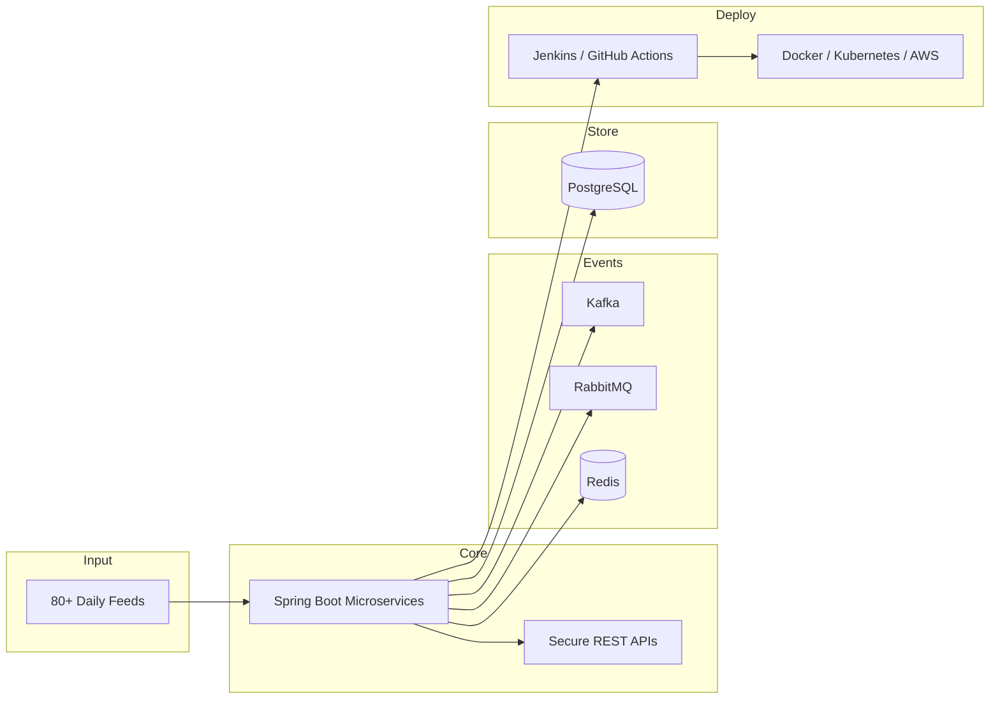

# MetaSystems — Enterprise Backend Platform (Portfolio Summary)

> **Note:** This documents professional work at MetaSystems. Source code is proprietary and not published.  
> This README is a **sanitized engineering summary** for portfolio / interview discussion.

[](https://www.java.com/)
[](https://spring.io/projects/spring-boot)
[](https://www.postgresql.org/)
[](https://kafka.apache.org/)
[](https://www.docker.com/)
[](https://kubernetes.io/)

## Overview

Developed **Java Spring Boot microservices** and **event-driven data pipelines** for enterprise financial and regulatory reporting workflows.

| | |
|---|---|
| **Role** | Software Engineer |
| **Period** | Jun 2021 – Jul 2024 |
| **Location** | Bangalore, India |
| **Scale** | **80+ financial and regulatory data feeds daily** |

## Architecture



## Key Features

| Feature | Engineering Focus | Impact |
|---|---|---|
| **Backend Service Development** | Java Spring Boot microservices + REST APIs | **80+ feeds/day** processing |
| **Microservices & Event Processing** | Kafka, RabbitMQ, Redis async pipelines | Cross-service data synchronization |
| **Secure API Platform** | Spring Security + JWT REST APIs | Authenticated service integrations |
| **Cloud Deployment & Performance** | Jenkins, Docker, K8s, GitHub Actions | **20% SQL performance gain** via indexing + Redis caching |
| **Software Quality & Delivery** | JUnit + PyTest, unit/integration/API tests | **85% code coverage**; Agile delivery |

## Tech Stack

| Category | Technologies |
|---|---|
| Languages | Java, Python |
| Backend | Spring Boot, REST APIs, microservices |
| Security | Spring Security, JWT |
| Messaging | Apache Kafka, RabbitMQ |
| Data | PostgreSQL, Redis |
| DevOps | Jenkins, Docker, Kubernetes, GitHub Actions, AWS |
| Testing | JUnit, PyTest |

## API Surface (Conceptual)

| Area | Capabilities |
|---|---|
| REST APIs | Enterprise reporting and integration endpoints |
| Auth | JWT-based service-to-service authentication |
| Event APIs | Async ingestion via Kafka / RabbitMQ consumers |

> OpenAPI specs and endpoints are proprietary.

## Setup

```text
Not publicly available — proprietary employer codebase.
```

## Screenshots

| Component | Preview |
|---|---|
| Service Dashboard | _Placeholder_ |
| Pipeline Monitoring | _Placeholder_ |
| CI/CD Pipeline | _Placeholder_ |

## Engineering Decisions

- **Kafka + RabbitMQ** for decoupled ingestion and downstream processing
- **Redis caching + SQL indexing** for read-path optimization (**20% query improvement** — resume-stated)
- **JUnit + PyTest** dual-stack testing for Java services and Python utilities
- **Containerized CI/CD** for repeatable production releases

## Future Improvements

- [ ] Expanded integration test coverage beyond 85%
- [ ] Centralized observability (metrics/tracing) across microservices
- [ ] Schema registry for Kafka event contracts
- [ ] Automated performance regression on critical SQL paths

## Contact

[LinkedIn](https://www.linkedin.com/in/ananyanagaraj/)
