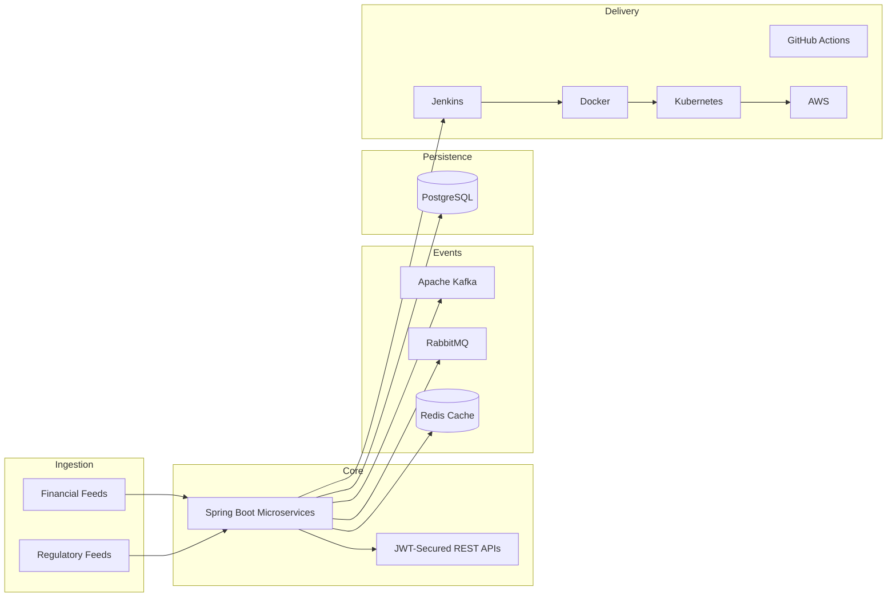

# MetaSystems — Enterprise Backend Platform (Portfolio Summary)

> **Repository status:** No public MetaSystems GitHub repository exists. This document summarizes **professional engineering work** (proprietary).

[](https://www.java.com/)
[](https://spring.io/projects/spring-boot)
[](https://www.postgresql.org/)
[](https://kafka.apache.org/)
[](https://www.docker.com/)

## Overview

| | |
|---|---|
| **Role** | Software Engineer |
| **Period** | Jun 2021 – Jul 2024 |
| **Location** | Bangalore, India |
| **Throughput** | **80+ financial and regulatory data feeds daily** |

Developed **Java Spring Boot microservices** and **event-driven pipelines** for enterprise financial/regulatory reporting workflows.

## Architecture



## Features

| System | Engineering Impact | Metric |
|---|---|---|
| **Backend Service Development** | Spring Boot microservices + REST APIs | **80+ feeds/day** |
| **Microservices & Event Processing** | Kafka, RabbitMQ, Redis async pipelines | Cross-service synchronization |
| **Secure API Platform** | Spring Security + JWT authentication | Service-to-service security |
| **Cloud Deployment & Performance** | CI/CD + SQL optimization | **20% query improvement** |
| **Software Quality & Delivery** | JUnit + PyTest testing | **85% code coverage** |

## Tech Stack

| Category | Technologies |
|---|---|
| Languages | Java, Python |
| Backend | Spring Boot, REST APIs, microservices |
| Security | Spring Security, JWT |
| Messaging | Apache Kafka, RabbitMQ |
| Data | PostgreSQL, Redis |
| DevOps | Jenkins, Docker, Kubernetes, GitHub Actions, AWS |
| Testing | JUnit, PyTest |

## API Documentation (Conceptual)

| Endpoint Category | Purpose |
|---|---|
| **Reporting APIs** | Enterprise data ingestion and reporting |
| **Integration APIs** | Internal service-to-service communication |
| **Event Consumers** | Kafka/RabbitMQ message handlers |

Authentication: **JWT** via Spring Security.

## Folder Structure (Typical Pattern)

```text
metasystems-backend/            # conceptual — not published
├── services/
│   ├── feed-processor/
│   ├── reporting-api/
│   └── integration-gateway/
├── messaging/
│   ├── kafka-consumers/
│   └── rabbitmq-handlers/
├── security/                   # JWT, Spring Security config
├── data/                       # PostgreSQL repositories
├── infra/                      # Docker, K8s, Jenkins pipelines
└── tests/                      # JUnit + PyTest
```

## Installation / Setup

```text
Not publicly available — proprietary employer codebase.
Local development typically requires:
  - Java 11+
  - PostgreSQL
  - Kafka / RabbitMQ (local or docker-compose)
  - Spring Boot application profiles
```

## Development Workflow

1. Implement microservice feature branch  
2. Unit + integration tests (JUnit/PyTest)  
3. Jenkins/GitHub Actions CI pipeline  
4. Docker image build  
5. Kubernetes deployment to AWS  

## Deployment Guide

| Stage | Tooling |
|---|---|
| Build | Maven/Gradle + Jenkins |
| Containerize | Docker |
| Orchestrate | Kubernetes |
| Cloud | AWS |
| Cache | Redis |
| Database | PostgreSQL |

## Screenshots

| View | Placeholder |
|---|---|
| Service monitoring | _Placeholder_ |
| CI/CD pipeline | _Placeholder_ |
| API gateway metrics | _Placeholder_ |

## Design Patterns

- **Microservices** with domain-separated services  
- **Event-driven architecture** (Kafka + RabbitMQ)  
- **Repository pattern** for PostgreSQL access  
- **Cache-aside** with Redis for read optimization  
- **JWT stateless authentication** for service integration  

## Scalability

- Horizontal scaling of Spring Boot services on Kubernetes  
- Async decoupling via message queues for feed ingestion spikes  
- SQL indexing + Redis caching for read-path performance (**20% improvement** — resume-stated)

## Roadmap

- [ ] Expanded observability (metrics/tracing) across microservices  
- [ ] Kafka schema registry for event contracts  
- [ ] Performance regression suite for critical SQL paths  
- [ ] Increase integration test coverage beyond 85%

---

**Contact:** [LinkedIn](https://www.linkedin.com/in/ananyanagaraj/)
